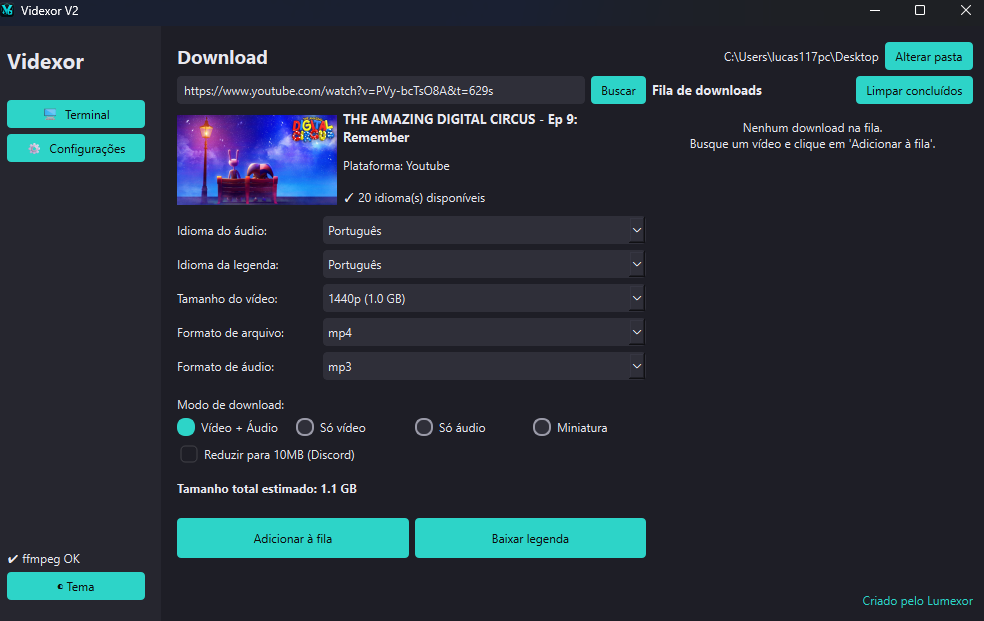
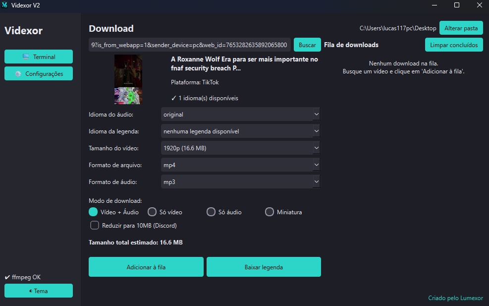
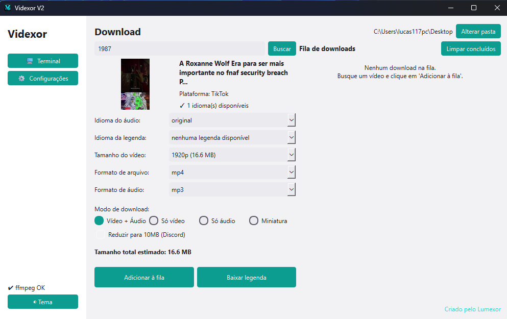
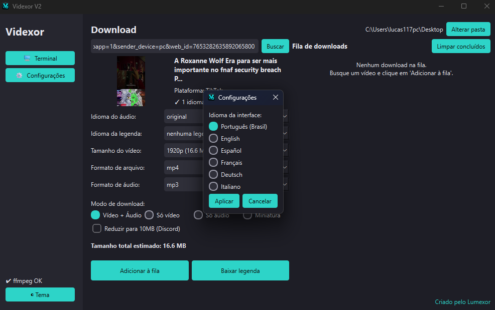

# Videxor

Downloader de vídeos com interface gráfica, feito com [yt-dlp](https://github.com/yt-dlp/yt-dlp) por baixo dos panos.

Baixe vídeos, áudio, miniaturas e legendas do YouTube, TikTok e outras plataformas, com fila de downloads e suporte a vários idiomas.

## Download

Vá em [**Releases**](../../releases) e baixe a versão mais recente (`Videxor.exe`).

Não precisa instalar nada antes — na primeira execução, um assistente de configuração verifica se o `ffmpeg` está presente e, se não estiver, baixa e configura tudo automaticamente.

## Funcionalidades

- Download de vídeo + áudio, só vídeo, só áudio, miniatura ou legenda
- Escolha de resolução, formato de arquivo e idioma de áudio/legenda (incluindo faixas dubladas)
- Fila de downloads com pausar/retomar
- Detecção automática de navegador aberto para uso de cookies (login), sem precisar configurar nada
- Redução automática de vídeo para até 10MB (compatível com limite de anexo do Discord)
- Interface em 6 idiomas: Português, English, Español, Français, Deutsch, Italiano
- Tema claro/escuro

## Screenshots

| Busca (YouTube) | Busca (TikTok) |
|---|---|
|  |  |

| Busca (TikTok) | Configurações de idioma |
|---|---|
|  |  |

## Como usar

1. Cole o link do vídeo e clique em **Buscar**.
2. Escolha idioma de áudio, resolução, formato e modo de download.
3. Clique em **Adicionar à fila**.
4. Acompanhe o progresso na fila de downloads (dá para pausar/retomar a qualquer momento).

## Requisitos

- Windows 10 ou 11
- Conexão com a internet

## Aviso legal

Este programa é uma ferramenta de uso pessoal. Baixar vídeos de plataformas como o YouTube pode violar os Termos de Serviço dessas plataformas, dependendo de como o conteúdo é usado depois.

- Use apenas para conteúdo que você tem direito de baixar (vídeos próprios, de domínio público, licenciados, ou para uso pessoal dentro do que a lei do seu país permite).
- Respeite direitos autorais. Não redistribua nem hospede conteúdo de terceiros baixado com esta ferramenta.
- Este projeto não é afiliado, endossado ou patrocinado por YouTube, TikTok, Google ou qualquer outra plataforma suportada pelo yt-dlp.
- O desenvolvedor não se responsabiliza pelo uso indevido desta ferramenta.

## Suporte

Encontrou um problema? Abra uma [issue](../../issues) descrevendo o erro.

---

Criado por **Lumexor**.
