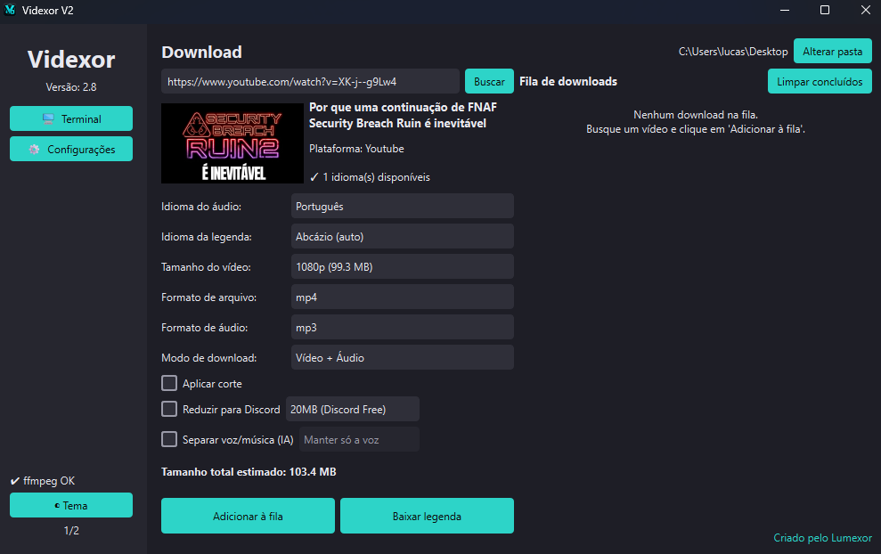
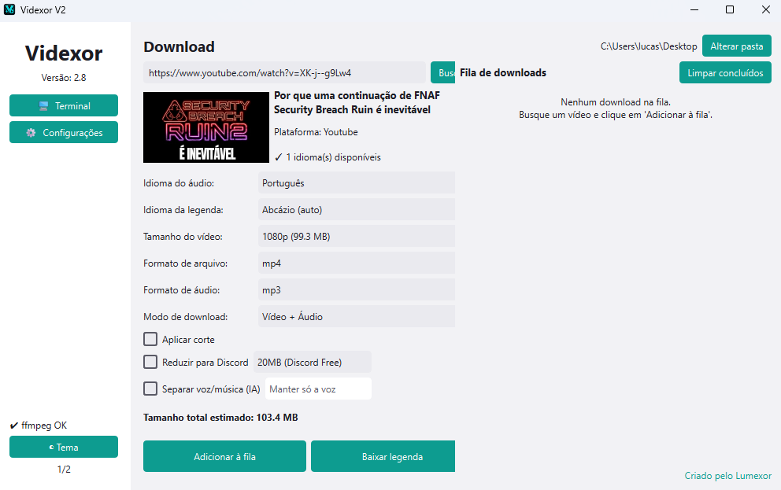
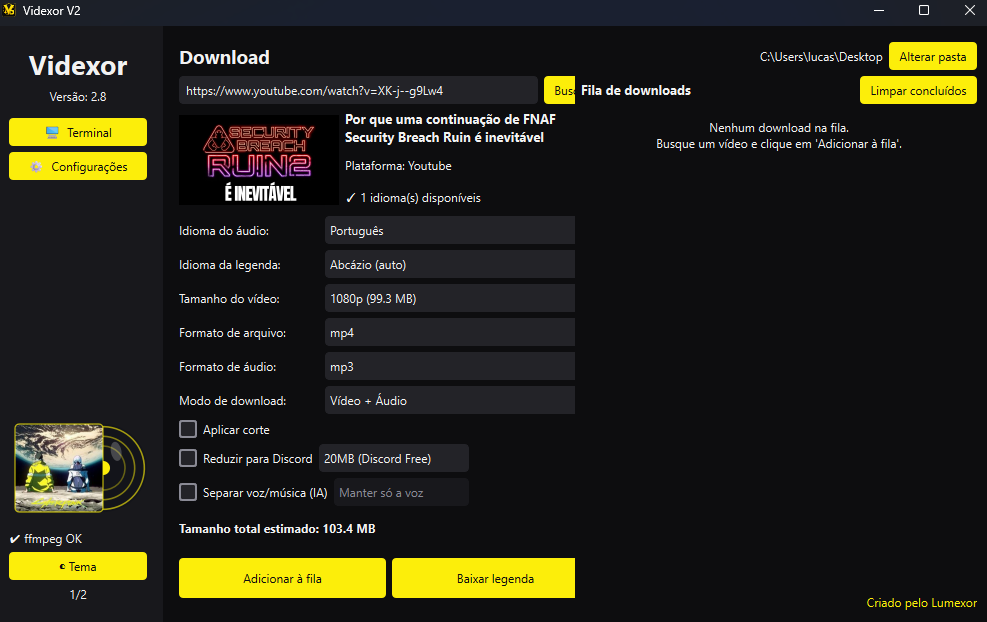
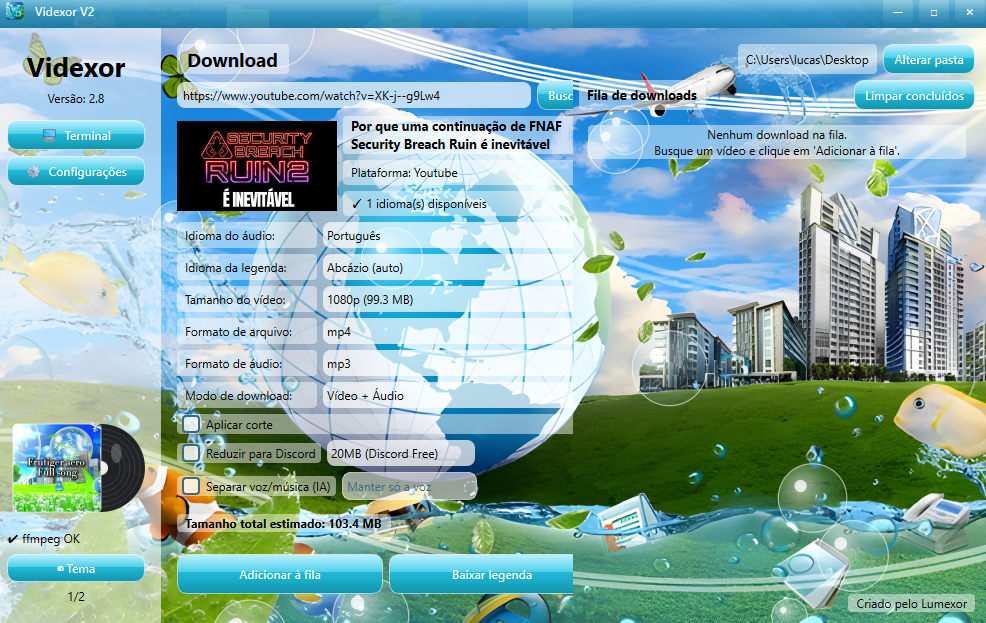

# Videxor V2.8

Downloader de vídeos com interface gráfica para Windows, criado por **Lumexor** e baseado no [yt-dlp](https://github.com/yt-dlp/yt-dlp).

Baixe vídeos, áudio, miniaturas, legendas e quadros de vídeos do YouTube, Twitch, TikTok e outras plataformas compatíveis. Organize os downloads em uma fila e selecione trechos de vídeos e lives disponíveis.

## Download e instalação

Acesse as [**Releases**](https://github.com/lucas117kk-debug/videxor-releases/releases) e escolha uma opção:

| Arquivo | Como funciona |
|---|---|
| **videxor-instalador.exe** | Instala por padrão em **Documentos\Videxor**, cria um atalho na Área de Trabalho e inclui desinstalador. |
| **videxor.exe** | Executável portátil único: basta baixar e executar. |

O pacote inclui FFmpeg, FFprobe, Deno, aria2 e os recursos da interface. Na versão instalada, a extração acontece durante a instalação, evitando repetir essa etapa ao abrir o programa.

A configuração **.videxor_config.json** é salva na pasta do Videxor, ao lado do executável. A atualização da versão instalada usa o instalador e preserva essa configuração.

## Funcionalidades

- Download de **Vídeo + Áudio**, **Só vídeo**, **Só áudio**, **Miniatura**, **Frames** e legendas.
- Escolha de resolução e formato de vídeo ou áudio.
- Seleção de idioma de áudio e legenda quando a plataforma disponibiliza essas opções, incluindo faixas dubladas.
- Fila de downloads com progresso, pausa, retomada e cancelamento.
- Opção **Aplicar corte**, combinável com os modos de vídeo, áudio e frames.
- Compressão para Discord com opções de tamanho de arquivo.
- Separação de voz e música por IA, com instalação opcional dos componentes necessários.
- Uso de cookies do navegador para acessar conteúdo que exige autenticação, quando compatível.
- Interface em **10 idiomas**: português, inglês, espanhol, francês, alemão, italiano, japonês, russo, chinês e árabe.
- Temas **Escuro**, **Claro**, **Cyberpunk** e **Frutiger Aero**.
- Três layouts de interface: clássico, compacto e agrupado.

## Corte de vídeos e lives

Escolha o modo de saída, marque **Aplicar corte** e clique em **Selecionar trecho...**. No player, marque o início e o fim e confirme em **Usar este trecho**.

| Plataforma | Prévia de corte |
|---|---|
| **YouTube** | Vídeos e lives usam streaming, sem baixar um vídeo local apenas para visualizar o trecho. |
| **Twitch** | Vídeos usam streaming. Para lives, o programa procura a gravação associada e utiliza o histórico disponível. |
| **TikTok** | A prévia de vídeos utiliza uma cópia temporária em resolução menor. |
| **Outras plataformas** | Não iniciam uma prévia de corte nem um download destinado a ela. |

A qualidade da prévia é independente da resolução escolhida para o download. A faixa de áudio selecionada é conferida para evitar substituição silenciosa por outro idioma.

**Lives:** o acesso ao começo depende do histórico oferecido pela plataforma. Na Twitch, é necessária uma gravação acessível da transmissão; sem ela, o seletor informa a limitação e permite consultar novamente. Miniaturas podem ser baixadas também durante uma live.

## Temas

| Escuro | Claro |
|---|---|
|  |  |

| Cyberpunk | Frutiger Aero |
|---|---|
|  |  |

## Como usar

1. Cole o link e clique em **Buscar**.
2. Escolha resolução, formatos, idioma e modo de download.
3. Para baixar um trecho, marque **Aplicar corte** e selecione o intervalo no player.
4. Se desejar, ative a compressão para Discord ou a separação de voz/música nos modos compatíveis.
5. Clique em **Adicionar à fila** e acompanhe o progresso.

Para legendas, escolha o idioma disponível e clique em **Baixar legenda**.

## Novidades da V2.8

- Novo instalador e tela de carregamento exibida mais cedo, com o ícone do último tema utilizado.
- Corte combinável com os outros modos; removida a opção antiga duplicada do menu.
- Melhorias na linha do tempo e no download de trechos históricos de lives do YouTube.
- Correções na identificação de gravações da Twitch, na seleção de áudio e na resolução usada pelos cortes.
- Miniaturas habilitadas em lives e ajustes para evitar sobreposição dos campos em janelas menores.
- Traduções revisadas nos controles de corte, prévia e histórico.
- Correção do erro de acesso negado ao atualizar o FFmpeg em uso, instalando a nova versão separadamente.
- Melhorias nas atualizações, nos arquivos temporários e na recuperação de falhas de processamento.

## História

O Videxor foi criado em 2025 por Lumexor para ajudar na criação de vídeos de IA. Com o fim desse formato de conteúdo, o projeto mudou de direção.

A partir do Videxor 2.0, o objetivo passou a ser oferecer um programa gratuito para baixar e converter vídeos com uma interface simples.

## Requisitos

- **Windows 10 ou 11 de 64 bits**.
- Conexão com a internet.
- Espaço livre para o programa, os downloads e os arquivos temporários.
- Componentes e modelos adicionais para os recursos opcionais de IA.

## Aviso legal

Este programa é uma ferramenta de uso pessoal. Baixar vídeos de plataformas como o YouTube pode violar os Termos de Serviço dessas plataformas, dependendo de como o conteúdo é usado depois.

- Use apenas para conteúdo que você tem direito de baixar (vídeos próprios, de domínio público, licenciados, ou para uso pessoal dentro do que a lei do seu país permite).
- Respeite direitos autorais. Não redistribua nem hospede conteúdo de terceiros baixado com esta ferramenta.
- Este projeto não é afiliado, endossado ou patrocinado por YouTube, TikTok, Google ou qualquer outra plataforma suportada pelo yt-dlp.
- O desenvolvedor não se responsabiliza pelo uso indevido desta ferramenta.

## Suporte

Encontrou um problema? Abra uma [issue](https://github.com/lucas117kk-debug/videxor-releases/issues) com a versão do programa, a plataforma, os passos para reproduzir o erro e, quando possível, uma captura ou log sem informações pessoais.

---

Criado por **Lumexor**.
